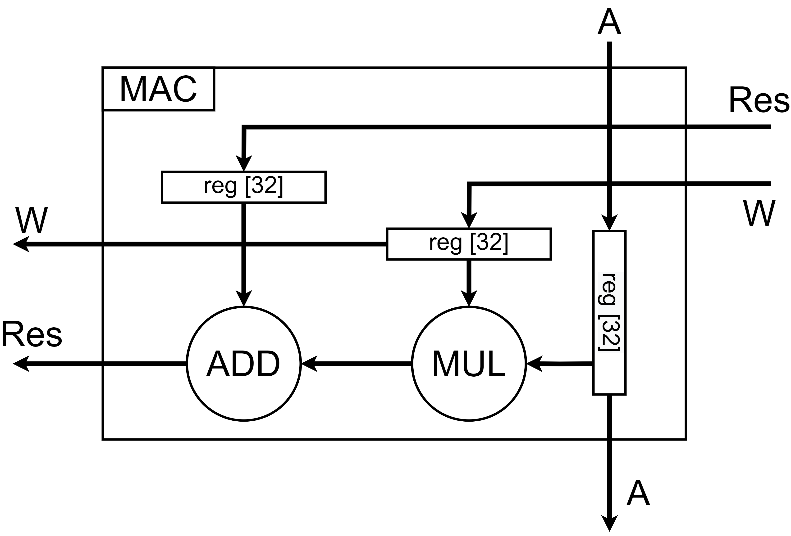
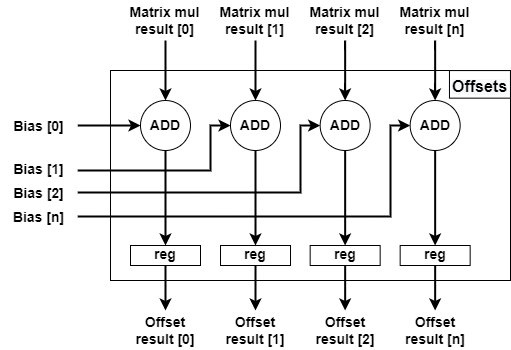
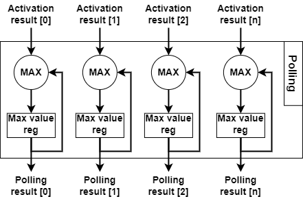

# NeuroChip

Table of Contents:

2. [Tensor core prototype](#Tensor-core-prototype)
    1. [Description](#Tensor-core-Description)
        1. [Tensor core architecture](#Tensor-core-architecture)
        2. [Microarchitecture of tensor core computing unit sub-blocks](#Tensor-core-computing-unit-microarchitecture)
    2. [Tensor core dir structure](#Tensor-core-dir-structure)
    3. [Simulation instruction](#Tensor-core-Simulation-instruction)

# Tensor core prototype 

Prototype of Tensor core for CNN processing acceleration

## Description 

### Tensor core architecture. 

### Microarchitecture of tensor core computing unit sub-blocks: 

- __Systolic array microarchitecture__

- __MAC sub-block microarchitecture__

- __Accumulators sub-block microarchitecture__

- __Offsets sub-block microarchitecture__

- __Activation sub-block microarchitecture__

- __Polling sub-block microarchitecture__

## Tensor core dir structure 

`tensor_core/doc` - documentation files for used libraries and useful information files

`tensor_core/src` - source files of neural processor modules

`tensor_core/tb` - testbench files for testing neural processor modules in a simulation environment

`tensor_core/xc7a100tcsg324_project` - Xilinx Vivado project for xc7a100tcsg324 FPGA

`tensor_core/xc7a100tcsg324_project/waveform_cfg` - Xilinx Vivado waveform configuration files for all testbenches

## Simulation instruction 

Xilinx Vivado CAD verison required: v2019.1 (64-bit)

1. Download and install Xilinx Vivado CAD
2. Open Vivado project `/xc7a100tcsg324_project/xc7a100tcsg324_project.xpr`
3. Select necessary testbench file and "Set as top"
4. Start "Behavioral Simulation"
5. The test results are displayed in the TCL console