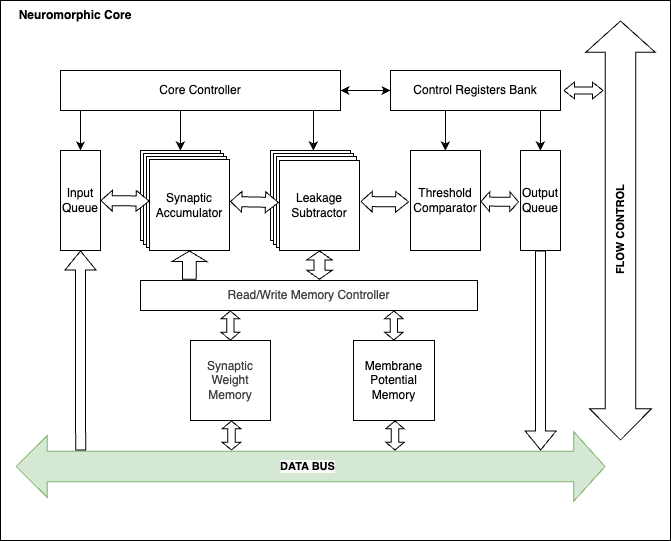
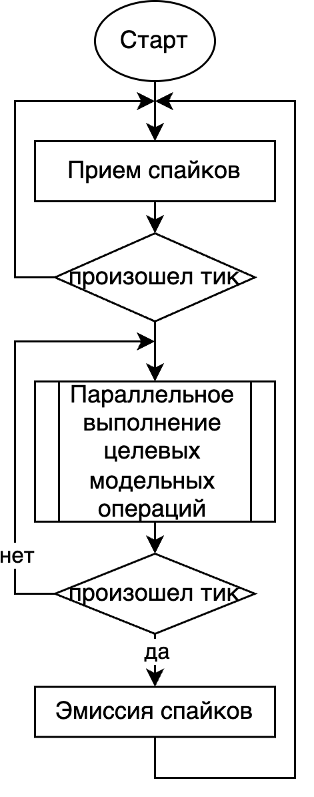

# Нейроморфное ядро нейропроцессора

## Описание
Нейроморфное ядро представляет собой специализированный сопроцессор, предназначенный для моделирования импульсных нейронных сетей (ИмНС).

## Процесс конфигурации нейроморфного ядра

1. Сброс ядра, инициализация состояния ядра перед началом работы
2. Запись начального адреса памяти с весовыми коэффициентами
3. Запись конфигурационных параметров (параметров моделей ИмНС)
4. Запись стартового бита для запуска вычислений

## Параметры целевых моделей импульсных нейронных сетей

| Параметр                  | Значение       |
|---------------------------|----------------|
| Количество нейронов в слое | 1024           |
| Количество слоев          | 16             |
| Количество синапсов на нейрон | 250         |

## Типы данных

### Статические параметры (весовые коэффициенты)
- **Формат**: Беззнаковое, фиксированная точка
- **Разрядность**: 4 бита

### Динамические параметры (мембранные потенциалы)
- **Формат**: Беззнаковое, фиксированная точка
- **Разрядность**: 11 бит

### Коэффициенты модели импульсных нейронов
- **Значение тока утечки**: Беззнаковое, фиксированная точка, 11 бит
- **Значение мембранного потенциала после сброса**: Беззнаковое, фиксированная точка, 11 бит
- **Значение порогового напряжения**: Беззнаковое, фиксированная точка, 11 бит

### Формат спайка
- **Адресация**: Идентификатор нейрона источника.

## Регистры управления

| Название регистра     | Разрядность, бит | Адрес в разделяемой памяти | Описание                          |
|-----------------------|------------------|----------------------------|-----------------------------------|
| `layers_num`          | 8                | na                          | Количество слоев                  |
| `neurons_num`         | 11               | na                          | Количество нейронов в слое        |
| `addr_weights`        | 16                | na                         | Адрес начала памяти весов         |
| `neuromorph_mode`     | 8                | na                          | Режим работы ядра (0x01 – запись конфигурации, 0x02 - чтение конфигурации, 0x03 – старт, 0x04 - стоп) |
| `param_leakage`       | 11                | na                          | Модельный параметр: утечка        |
| `param_v_reset`       | 11                | na                          | Модельный параметр: сброс         |
| `param_v_threshold`   | 11                | na                          | Модельный параметр: пороговое напряжение |

## Модель памяти

### Разделяемая память
- **Глубина памяти статических параметров**: 4096000 
- **Глубина памяти динамических параметров**: 1024

### Буферы планировщики
- **Размер входного буфера**: 16 КБ
- **Размер исходящего буфера**: 16 КБ

### Исключения
- Переполнение входящего буфера
- Переполнение исходящего буфера

## Микроархитектура нейроморфного ядра

### Параллелизм
- **Временной (time-multiplexing)**: Переключение блоков обработки нейронов для последовательной обработки слоев в рамках временного слота.
- **Пространственный**: Множество одновременно работающих вычислительных элементов для вычисления групп нейронов.

### Аппаратные блоки
- Core Controller
- Control Registers Bank
- Input Queue
- Synaptic Accumulator
- Leakage Subtractor
- Threshold Comparator
- Output Queue
- Read/Write Memory Controller
- Synaptic Weight Memory
- Membrane Potential Memory

## Алгоритм выполнения модели ИНС нейроморфным ядром

### Общий алгоритм вычислений нейроморфного ядра представлен на рисунке:

Выполнение целевых операций моделирования импульсных нейронов состоит из следующих шагов: 
1. **Прием спайков**: Получение входных спайков от внешних источников.
2. **Интегрирование мембранных потенциалов**: Обновление мембранных потенциалов постсинаптических нейронов в пределах одного тика.
3. **Расчет функции утечки**: Учет утечки мембранного потенциала.
4. **Сравнение с пороговым напряжением**: Проверка, превышает ли мембранный потенциал пороговое значение.
5. **Эмиссия спайка**: Генерация выходного спайка, если порог превышен.

---

