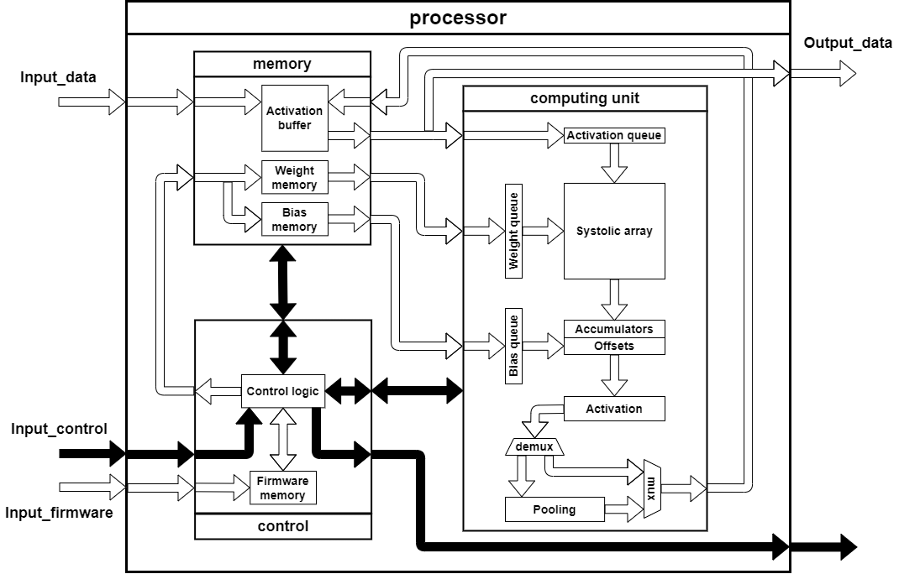
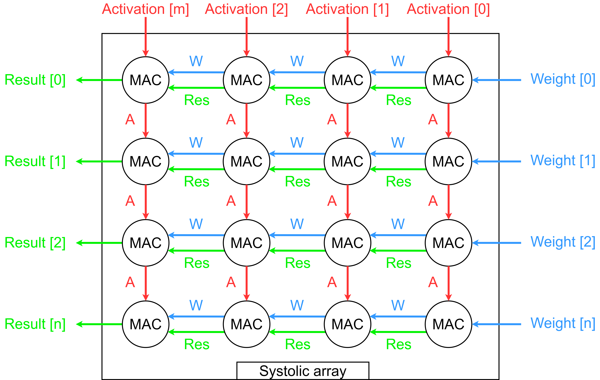
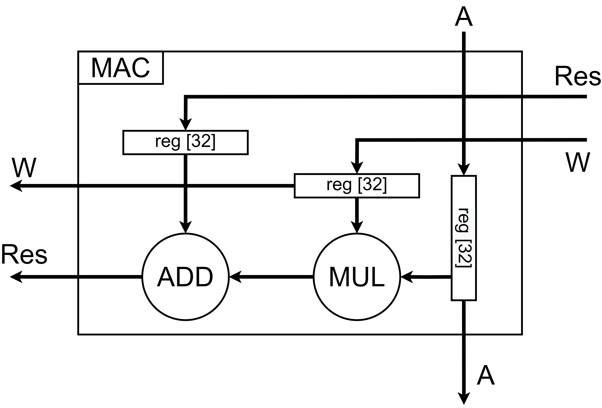
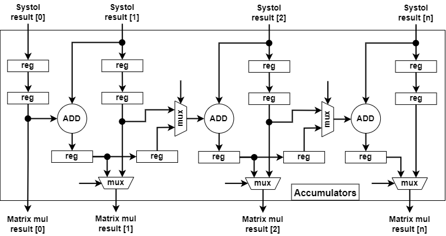
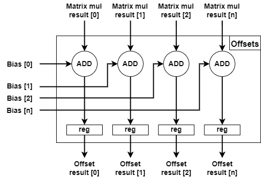
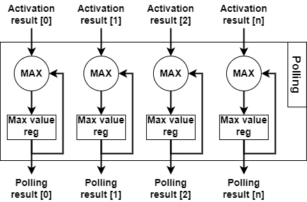

# Тензорное ядро

Прототип тензорного ядра для ускорения расчета сверточных нейронных сетей

----

Содержание:

1. [Описание](#Tensor-core-Description)
    1. [Архитектура](#Tensor-core-architecture)
    2. [Микроархитектура вычислительной подсистемы](#Tensor-core-computing-unit-microarchitecture)
2. [Структура директории тензорного ядра](#Tensor-core-dir-structure)
3. [Иструкция по моделированию](#Tensor-core-Simulation-instruction)

## Описание 

### Архитектура. 

### Микроархитектура вычислительной подсистемы: 

- __Микроархитектура систолического массива__

    

- __Микроархитектура MAC блоков__

    

- __Микроархитектура блока аккумулирования__

    

- __Микроархитектура блока смещений__

    

- __Микроархитектура блока активаций__

    

- __Микроархитектура блока пуллинга__

    

## Структура директории тензорного ядра 

`doc` - файлы с документации для используемых библиотек и полезной информацией

`src` - исходные файлы модулей тензорного ядра

`tb` - файлы тестового окружения для тестирования модулей тензорного ядра в среде моделирования

`xc7a100tcsg324_project` - Проект Xilinx Vivado для ПЛИС xc7a100tcsg324

`xc7a100tcsg324_project/waveform_cfg` - Файлы конфигурации временных диаграмм Xilinx Vivado

## Иструкция по моделированию 

Требуется версия Xilinx Vivado CAD: v2019.1 (64-разрядная версия)

1. Загрузите и установите Xilinx Vivado CAD.
2. Откройте проект Vivado `/xc7a100tcsg324_project/xc7a100tcsg324_project.xpr`
3. Выберите необходимый файл testbench и установите как основной ("Set as top").
4. Запустите поведенческое моделирование ("Behavioral Simulation")
5. Результаты тестирования отобразятся в консоли TCL